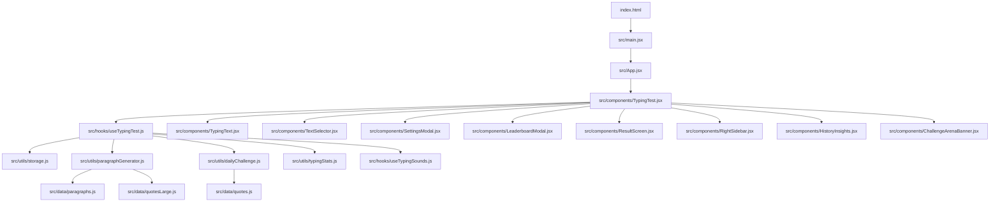

# GoType Project Details

GoType is a modern competitive typing practice app with its own arena-driven challenge system, badge progression, live performance tracking, and a polished dark/light interface. It is built as a fast React + Vite experience that focuses on smooth typing, persistent progress, and clear feedback for both casual practice and high-pressure challenge runs.

This document is a full project reference for the current codebase. It explains the product, the architecture, the runtime flow, the current folder structure, the major implementation details, the SEO and deployment setup, and the latest round of improvements.

## Project Overview

GoType is designed around a single, responsive typing surface that supports several test families:

- Classic Core typing with Time, Words, and Goal modes.
- Quote mode for punctuation and rhythm practice.
- Custom mode for user-pasted text.
- Numbers mode for mixed numeric typing drills.
- Challenge Arena for daily locked challenges, memory fades, and badge rewards.

The experience is built to feel competitive and immediate:

- Live WPM, accuracy, word progress, and time remaining update continuously.
- Best WPM is stored per mode so progress is tracked separately for each test family.
- Challenge Arena introduces rules such as no-backspace, target WPM, sustain windows, and memory fades.
- Badges provide a long-term progression layer with repeated earn counts and visual rewards.
- The UI uses persistent settings, smooth scrolling, and motion design to keep the typing flow uninterrupted.

## Tech Stack

The current project stack is:

- React 18 for the UI.
- Vite for development, bundling, and production builds.
- Tailwind CSS for layout, theming, and component styling.
- Framer Motion for page transitions, animated controls, and result/overlay motion.
- Lucide React for the icon system used across the app.
- canvas-confetti for celebratory animations on strong results and challenge completion.
- Vitest for unit testing.
- jsdom and Testing Library for browser-like test execution.
- vite-plugin-sitemap for generating sitemap output during build.

Not currently used:

- Recharts is not installed in the current package list. The result performance view is implemented with the app’s own UI and animation code rather than a charting library.

Built-in browser/platform APIs used heavily in the codebase:

- localStorage for persistence.
- AudioContext for sound playback.
- requestAnimationFrame for scroll synchronization.
- Resize/scroll event listeners for layout-aware overlays and scroll behavior.

## End-to-End User Flow

The app experience from launch to completion is:

1. The browser loads [index.html](index.html), which mounts the React app through [src/main.jsx](src/main.jsx).
2. [src/App.jsx](src/App.jsx) reads the saved theme and applies the app shell.
3. [src/components/TypingTest.jsx](src/components/TypingTest.jsx) renders the typing workspace, top selector, stats, sidebars, dialogs, and Arena overlays.
4. [src/hooks/useTypingTest.js](src/hooks/useTypingTest.js) creates the prompt, runs the timer, captures input, and computes live performance.
5. The user selects a mode, types into the prompt, and sees live feedback in the stats row and sidebar.
6. In Challenge Arena, the app may fade memory words, enforce no-backspace rules, lock after failed attempts, and award badges on completion.
7. When the run ends, [src/components/ResultScreen.jsx](src/components/ResultScreen.jsx) shows the outcome, bests, and recent performance chart.
8. History, leaderboard, badge gallery, settings, and onboarding remain accessible from the surrounding UI.

## Architecture & Data Flow

The app is intentionally split into a presentation layer and a state/engine layer.



### Engine responsibilities

[src/hooks/useTypingTest.js](src/hooks/useTypingTest.js) is the central controller. It:

- Loads persisted settings and mode state.
- Generates the active prompt based on the selected test type.
- Tracks typed text, correctness, cursor position, elapsed time, WPM, and accuracy.
- Handles mode transitions, restarts, and text regeneration.
- Applies challenge rules for Arena runs.
- Appends more content for longer endless sessions.
- Produces the final result object and persists it into storage.

### UI responsibilities

[src/components/TypingTest.jsx](src/components/TypingTest.jsx) is the page-level orchestrator. It:

- Connects the hook output to the visible interface.
- Renders the header, top selector, stats row, main typing area, right sidebar, and mobile sidebar drawer.
- Owns modal state for settings, leaderboard, badge gallery, and onboarding.
- Controls keyboard shortcuts and focus behavior.
- Shows Challenge Arena banners and overlays.

[src/components/TypingText.jsx](src/components/TypingText.jsx) is the prompt renderer. It:

- Tokenizes and renders each word and character.
- Highlights correctness and the active cursor position.
- Keeps the visible typing area anchored while supporting manual scrolling.
- Applies custom scroll behavior with a user-configurable bottom margin.

## Core Features

### Classic Core mode

Classic Core is the app’s main practice lane. It currently includes:

- Time mode with configurable test duration.
- Words mode with preset word counts and editable custom counts.
- Goal mode with Sustain and Reach variants.

Details:

- Time mode supports the common presets and custom input.
- Words mode offers preset counts and a custom numeric field.
- Goal Sustain focuses on holding the target WPM for a window of time.
- Goal Reach focuses on completing the full prompt while meeting the target.
- Best WPM is stored separately for each mode family and variant.

### Quote, Custom, and Numbers modes

- Quote mode types preset quote content and emphasizes rhythm, punctuation, and consistency.
- Custom mode accepts pasted user text and lets the user practice any passage.
- Numbers mode generates mixed numeric text for number-heavy practice.

### Challenge Arena

Challenge Arena is the competitive layer of GoType. It is driven by daily challenge templates and can include different rule families:

- Endurance challenges.
- No-backspace control challenges.
- Speed spike challenges with sustain windows.
- Perfectionist challenges.
- Numbers challenges.
- Memory challenges.

Key Arena behavior:

- Daily challenge templates are generated from a seeded challenge catalog.
- The app uses a reuse window to avoid repeating the same challenge too soon.
- Arena runs can require minimum WPM, minimum accuracy, specific time limits, sustain thresholds, or no-backspace constraints.
- Memory challenge runs can hide the prompt after a delay and then progressively fade words.
- Failed Arena runs are limited by a three-attempt daily cap.
- Once the attempt limit is reached, the lock overlay blocks the run until the next day.

### Badge system

GoType has a real progression system built around badges.

- There are multiple badge families and five tiers per family, plus milestone badges.
- Badge records are stored in localStorage and sanitized before use.
- Badge icons use Lucide icon names rather than custom bitmap art.
- Badge earn counts are tracked, so repeated completions can show multipliers such as x2, x3, and higher.
- The Badge Gallery shows earned and locked badges in a browsable collection.
- Challenge cards and arena completion flows surface the reward name and count.

### Real-time performance tracking

The app continuously updates:

- Live WPM.
- Accuracy.
- Remaining time.
- Completed word count.
- Current word progress.

The result screen also includes a recent performance visualization. It is currently implemented with the project’s own UI and animation code, not with Recharts.

### Auto-scroll with configurable bottom margin

The typing surface keeps the active word visible without feeling jumpy.

- The scroll system uses a custom scroll calculation rather than a simple `scrollIntoView` call.
- The default bottom margin is 50px.
- The margin is user-adjustable in Settings.
- The scrolling logic respects manual user scrolling instead of constantly forcing the viewport.
- When the prompt grows during long sessions, the scroll system resynchronizes using a scroll tick from the typing hook.

### Sound system

The app includes browser-based sound feedback:

- Keypress sounds.
- Error sounds.
- Milestone or celebration sounds.
- Sound volume control.
- Mute/unmute persistence.

The audio system is handled through Web Audio and storage-backed settings.

### Theme persistence

- The app supports dark and light themes.
- Theme preference persists across sessions.
- The root app shell applies the selected theme to the document.

### History & Insights

The History & Insights area provides:

- Recent result history.
- Mistake heatmap style summaries.
- CSV export for local result data.

### Leaderboard

The leaderboard modal supports:

- Filtering by mode.
- Filtering by Goal variant.
- Sorting by WPM and accuracy.
- High-accuracy result curation.

Only qualifying scores are shown, and Goal Reach behaves more strictly because it requires the full completion rules to be satisfied.

### Streak and daily goal tracker

The sidebar tracks:

- Daily goal progress.
- Streak information.
- Recent challenge history.
- Current best WPM.

### Keyboard shortcuts

The current codebase wires these keyboard shortcuts:

- Ctrl+Shift+R or Cmd+Shift+R to restart.
- Ctrl+Shift+S or Cmd+Shift+S to toggle sound.

Important note:

- Escape is not globally wired in the current implementation. Modal surfaces are closed through their explicit controls and overlay actions.

### Welcome tour

The first-run onboarding tour highlights the current layout:

- The top selector for Classic Core, Quotes, Custom, and Numbers.
- The typing panel.
- The Challenge Arena and daily tools in the right sidebar.
- The live stats row.
- The top-right controls.

The tour is designed to orient a new user quickly without showing outdated layout terms.

## Key Implementation Details

### Per-word fading in Memory Test

Memory-style Arena challenges hide the prompt after `hideAfterSeconds` and then fade words over time.

How it works:

- [src/hooks/useTypingTest.js](src/hooks/useTypingTest.js) creates timers for the current memory challenge.
- A delay is derived from the challenge rules, usually 3 seconds in the current templates.
- Once the idle delay elapses, the next unfaded word is marked as faded.
- Additional timers continue fading later words while the user remains idle.
- The hook keeps `challengePromptHidden` and `challengeHasTextFaded` flags so completion validation can tell whether the user actually solved a fading-memory run.

Result validation uses these flags, so Arena Memory completion is only valid if the prompt was hidden/faded and the challenge was finished under the required rules.

### Scroll margin behavior

Auto-scroll is handled by a custom, margin-aware function:

- The visible target is measured using refs rather than a DOM query each time.
- The scroll function aims to keep the current word comfortably above the bottom edge.
- The margin is stored in localStorage under the scroll margin setting key.
- The Settings modal exposes the control as a slider.
- The scroll system uses `requestAnimationFrame`-style scheduling to reduce layout thrash.

### Badge storage and updates

Badge records are persisted as a sanitized array.

- Each stored badge keeps a `badgeId`, display name, icon name, and `earnedCount`.
- `updateBadgeCount` increments the badge’s count when the same badge is earned again.
- Challenge completion flows can attach badge metadata such as the badge name and icon name to the result.
- The badge gallery reads from the persisted badge list and shows the current multiplier state.

The app therefore supports both one-time milestone badges and repeatable challenge badges with visible earned counts.

### Daily challenge selection and repeat avoidance

Daily challenge generation lives in [src/utils/dailyChallenge.js](src/utils/dailyChallenge.js).

- Challenge templates are built from a family-and-tier catalog.
- Challenge selection uses a seeded random generator.
- The seed is derived from the date and challenge identity so the same day produces stable results.
- A reuse window prevents the same challenge from resurfacing too quickly.
- The catalog includes multiple families, including memory, numbers, endurance, control, spike, and precision.

This keeps daily Arena content feeling fresh without becoming random noise.

### Lock overlay and attempt limit

Arena attempts are capped.

- The app tracks attempts used today.
- Failed attempts eventually trigger a locked state.
- A lock overlay blocks interaction when the user has exhausted the daily limit.
- The overlay encourages the user to exit back to Classic Core.
- The overlay also prevents typing focus so the user cannot continue the blocked challenge.

### SEO implementation

SEO is handled across HTML shells, static assets, and build output.

Current SEO pieces include:

- [index.html](index.html) with GoType branding, Open Graph tags, Twitter card tags, structured data, and `robots` indexing.
- [legal.html](legal.html), [privacy.html](privacy.html), [terms.html](terms.html), and [contact.html](contact.html) with page-specific titles and descriptions.
- [public/robots.txt](public/robots.txt) that points to the sitemap.
- [public/manifest.json](public/manifest.json) for installable web-app metadata.
- A social preview image at [public/og-image.png](public/og-image.png).
- A sitemap generated during the build.
- A post-build cleanup script that sanitizes the sitemap output.
- Vercel routing rules to preserve the clean URL variants and the legacy `.html` links.

## Folder Structure

The current `src/` tree is:

```text
src/
├─ App.jsx
├─ index.css
├─ main.jsx
├─ legal.jsx
├─ components/
│  ├─ AppLogo.jsx
│  ├─ BadgeGalleryModal.jsx
│  ├─ ChallengeArenaBanner.jsx
│  ├─ ChallengeCard.jsx
│  ├─ Footer.jsx
│  ├─ GoalModeSettings.jsx
│  ├─ HistoryInsights.jsx
│  ├─ LeaderboardModal.jsx
│  ├─ LegalPage.jsx
│  ├─ ModeSwitcher.jsx
│  ├─ ResultScreen.jsx
│  ├─ RightSidebar.jsx
│  ├─ SettingsModal.jsx
│  ├─ SidebarModal.jsx
│  ├─ SoundControls.jsx
│  ├─ Stats.jsx
│  ├─ TextSelector.jsx
│  ├─ TypingTest.jsx
│  ├─ TypingText.jsx
│  └─ WelcomeTour.jsx
├─ constants/
│  └─ typingModes.js
├─ data/
│  ├─ paragraphs.js
│  ├─ quotes.js
│  └─ quotesLarge.js
├─ hooks/
│  ├─ useTypingSounds.js
│  └─ useTypingTest.js
└─ utils/
   ├─ dailyChallenge.js
   ├─ paragraphGenerator.js
   ├─ storage.js
   ├─ typingStats.js
   └─ __tests__/
      ├─ dailyChallenge.test.js
      ├─ storage.test.js
      └─ typingStats.test.js
```

## File Responsibilities

### Root app files

#### [src/main.jsx](src/main.jsx)

- Mounts the React application into the Vite root node.
- Serves as the browser entry point for the typing app.

#### [src/App.jsx](src/App.jsx)

- Owns the top-level theme state.
- Applies the current theme to the document.
- Renders the main typing experience and the footer.

#### [src/legal.jsx](src/legal.jsx)

- Separate entry point for the legal/policy page.
- Shares the same theme and styling system as the main app.

#### [src/index.css](src/index.css)

- Global theme tokens.
- Typography, spacing, card, button, scrollbar, and animation utilities.
- Typing surface and scroll behavior helpers.

### Components

#### [src/components/TypingTest.jsx](src/components/TypingTest.jsx)

- Main orchestration layer for the app.
- Header controls, top selector, stats, main typing panel, sidebar, modals, Arena overlays, and onboarding.
- Bridges keyboard input, focus state, and engine state to the UI.

#### [src/components/TypingText.jsx](src/components/TypingText.jsx)

- Renders each word and character.
- Draws the active cursor state and correctness coloring.
- Handles custom scroll anchoring and manual-scroll respect.

#### [src/components/TextSelector.jsx](src/components/TextSelector.jsx)

- The top mode selector.
- Switches between Classic Core, Quotes, Custom, and Numbers.
- Exposes the custom-text editor when Custom mode is active.

#### [src/components/ChallengeArenaBanner.jsx](src/components/ChallengeArenaBanner.jsx)

- Shows the active Arena challenge summary.
- Surfaces the objective, badge reward, rules, and attempt state.

#### [src/components/ChallengeCard.jsx](src/components/ChallengeCard.jsx)

- The challenge card used in the sidebar.
- Shows the current challenge, reward, earned multiplier, and arena entry/retry actions.

#### [src/components/RightSidebar.jsx](src/components/RightSidebar.jsx)

- Desktop stats and progress column.
- Hosts best WPM, live WPM, streaks, daily goals, and challenge entry controls.

#### [src/components/SidebarModal.jsx](src/components/SidebarModal.jsx)

- Mobile drawer wrapper for the right sidebar content.
- Keeps the sidebar available on small screens.

#### [src/components/SettingsModal.jsx](src/components/SettingsModal.jsx)

- Sound, theme, and typing scroll settings.
- Includes the user-adjustable bottom scroll margin control.

#### [src/components/LeaderboardModal.jsx](src/components/LeaderboardModal.jsx)

- Leaderboard and recent result browser.
- Filters by mode and Goal variant.
- Shows only high-accuracy results.

#### [src/components/HistoryInsights.jsx](src/components/HistoryInsights.jsx)

- Recent result history.
- Mistake heatmap summary.
- CSV export action.

#### [src/components/ResultScreen.jsx](src/components/ResultScreen.jsx)

- Final result summary.
- Best WPM comparison.
- Challenge-Arena-specific success/failure states.
- Recent performance visualization.

#### [src/components/BadgeGalleryModal.jsx](src/components/BadgeGalleryModal.jsx)

- Full badge browser.
- Shows earned, locked, and repeated badge states.

#### [src/components/Footer.jsx](src/components/Footer.jsx)

- Footer navigation and policy links.
- Connects the main app to legal and contact pages.

#### [src/components/LegalPage.jsx](src/components/LegalPage.jsx)

- Single page rendering for policy and contact information.

#### [src/components/SoundControls.jsx](src/components/SoundControls.jsx)

- Compact sound toggle and volume control in the header.

#### [src/components/GoalModeSettings.jsx](src/components/GoalModeSettings.jsx)

- Reusable Goal mode target setup controls.

#### [src/components/Stats.jsx](src/components/Stats.jsx)

- Reusable stat cards for WPM and accuracy presentation.

#### [src/components/AppLogo.jsx](src/components/AppLogo.jsx)

- Brand mark and app identity component.

#### [src/components/WelcomeTour.jsx](src/components/WelcomeTour.jsx)

- First-run guided tour overlay.
- Highlights the active region and displays step-by-step onboarding copy.

#### [src/components/ModeSwitcher.jsx](src/components/ModeSwitcher.jsx)

- Legacy or alternate mode-switching component kept in the tree.
- The primary current selector is [src/components/TextSelector.jsx](src/components/TextSelector.jsx).

### Hooks

#### [src/hooks/useTypingTest.js](src/hooks/useTypingTest.js)

This is the core engine.

It handles:

- Prompt generation.
- Timer start/stop and elapsed time tracking.
- Correct and incorrect character tracking.
- Word progress and caret position.
- Accuracy and WPM calculations.
- Arena challenge validation.
- Memory fade timers.
- Endless text append logic.
- Result creation and storage updates.

Important engine patterns:

- Memoized prompt/token data reduces repeated split/map work.
- Refs hold rapidly changing counters so the UI does not rerender on every keystroke.
- Append logic extends the existing prompt for long sessions rather than resetting the run.
- A scroll sync tick is emitted when appended content needs the typing surface to recenter.

#### [src/hooks/useTypingSounds.js](src/hooks/useTypingSounds.js)

- Manages the audio context and sound playback.
- Plays typing feedback and milestone effects.
- Persists sound settings.

### Constants and data

#### [src/constants/typingModes.js](src/constants/typingModes.js)

- Central mode IDs and default settings.
- Goal variant values.
- Default durations and labels used across the app.

#### [src/data/paragraphs.js](src/data/paragraphs.js)

- Paragraph source material for ordinary typing practice.
- Also feeds generated endless content.

#### [src/data/quotes.js](src/data/quotes.js)

- Quote loader and fallback logic.
- Uses the local large quote bank and can fall back gracefully when remote content is unavailable.

#### [src/data/quotesLarge.js](src/data/quotesLarge.js)

- Large local quote bank for quote mode.

### Utilities

#### [src/utils/storage.js](src/utils/storage.js)

- Centralized localStorage access and sanitization.
- Theme, sound, scroll margin, onboarding, results, leaderboard, badges, streaks, and daily goal persistence.
- Badge save/update helpers.

#### [src/utils/paragraphGenerator.js](src/utils/paragraphGenerator.js)

- Random paragraph generation.
- Numbers-mode text generation.
- Endless chunk generation for longer typing sessions.

#### [src/utils/dailyChallenge.js](src/utils/dailyChallenge.js)

- Builds and validates daily Challenge Arena content.
- Chooses seeded daily challenges and keeps history to avoid repeats.
- Defines challenge families, rule sets, and badge metadata.

#### [src/utils/typingStats.js](src/utils/typingStats.js)

- WPM and accuracy math.
- Mistake aggregation helpers.

#### [src/utils/**tests**/dailyChallenge.test.js](src/utils/__tests__/dailyChallenge.test.js)

- Challenge generation and validation tests.

#### [src/utils/**tests**/storage.test.js](src/utils/__tests__/storage.test.js)

- Persistence and sanitization tests.

#### [src/utils/**tests**/typingStats.test.js](src/utils/__tests__/typingStats.test.js)

- Accuracy and WPM calculation tests.

## Persistence Model

The app stores user state in localStorage.

### Common categories

- Theme.
- Sound enabled and volume.
- Scroll margin.
- Onboarding seen flag.
- Mode and goal preferences.
- Best WPM by mode.
- Recent results.
- Leaderboard entries.
- Badge collection.
- Streak and daily goal information.
- Daily Arena attempt state.

### Badge records

Badge storage entries are normalized and usually include:

- `badgeId`
- `name`
- `iconName`
- `earnedCount`
- Optional challenge metadata such as earn time or family information

### Result records

Saved result objects include fields such as:

- Mode key.
- Word count or time limit.
- Goal variant.
- WPM.
- Accuracy.
- Correct and incorrect character counts.
- Time used.
- Challenge flags such as completion, failure, text-fade usage, and prompt-hidden usage.

## Setup and Development

### Install

```bash
npm install
```

### Development server

```bash
npm run dev
```

### Production build

```bash
npm run build
```

The build currently runs:

```bash
vite build && node scripts/fix-sitemap.mjs
```

### Tests

```bash
npm run test
```

### Preview

```bash
npm run preview
```

## Deployment

The project is prepared for Vercel deployment.

- [vercel.json](vercel.json) handles clean routes and legacy `.html` compatibility.
- The sitemap is generated during the build and then sanitized by [scripts/fix-sitemap.mjs](scripts/fix-sitemap.mjs).
- The static pages and the main typing app are both included in the Vite build inputs.

Public SEO assets include:

- [public/robots.txt](public/robots.txt)
- [public/manifest.json](public/manifest.json)
- [public/og-image.png](public/og-image.png)

## Testing and Validation

Current automated coverage focuses on the utility layer:

- Challenge generation and validation.
- Storage sanitization and persistence.
- Typing statistics math.

The project uses Vitest in jsdom mode, which makes it suitable for browser-like UI and utility tests without a real browser runtime.

## Recent Changes / Changelog

The most recent major improvements are:

- Challenge Arena was hardened with daily unique templates, rule validation, badge rewards, and attempt locking.
- Memory-test behavior was expanded to support per-word fading after an idle delay.
- Auto-scroll was rewritten to use a configurable bottom margin, manual-scroll respect, and append-aware resynchronization.
- The result screen gained a more engaging recent-performance visualization.
- SEO was upgraded with proper titles, descriptions, canonical structure, manifest support, structured data, robots.txt, and sitemap generation.
- Static policy pages were aligned with the app’s clean routing setup for deployment.
- The welcome tour was updated to reflect the current layout, including the Arena sidebar and modern top controls.

## Notes for Future Work

- Recharts is not currently part of the dependency tree; if a future chart library is introduced, this document should be updated.
- Escape key handling is not globally wired at the moment and would need a small pass if you want modal dismissal from the keyboard everywhere.
- If the badge catalogue grows, the storage helpers and gallery layout should be reviewed for pagination or grouping.

## Short Version

If you need the one-sentence description:

GoType is a modern React typing app with Classic Core modes, Quote/Custom/Numbers practice, daily Challenge Arena runs, badge progression, live stats, history and leaderboard tracking, SEO-ready pages, and a Vercel-friendly deployment setup.
