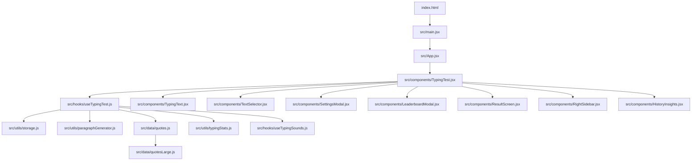

# GoType Project Manual

## Overview

GoType is a React + Vite typing practice app built around a single-page test surface, persistent settings, live typing metrics, history, leaderboard tracking, and a polished dark/light UI.

The current app supports:

- Time mode with configurable time limits.
- Words mode with 25, 50, and 100 word tests.
- Quote mode with a local quote pool and remote fallback.
- Custom mode with pasted user text.
- Goal mode with Sustain and Reach variants.
- Numbers mode for mixed numeric typing practice.
- Live WPM, accuracy, streaks, daily goals, sound feedback, history, leaderboard, and onboarding.

## Current System Snapshot

- The app bootstraps from [index.html](index.html) into [src/main.jsx](src/main.jsx).
- [src/App.jsx](src/App.jsx) owns the theme and wraps the main typing experience plus the footer.
- [src/components/TypingTest.jsx](src/components/TypingTest.jsx) is the orchestration layer for the typing session and top-level UI.
- [src/hooks/useTypingTest.js](src/hooks/useTypingTest.js) owns the core state machine, timers, scoring, appending logic, and persistence hooks.
- [src/components/TypingText.jsx](src/components/TypingText.jsx) renders the prompt, caret, and scroll behavior.
- Results are written to `localStorage` through [src/utils/storage.js](src/utils/storage.js).

## Current Changes

The typing engine and rendering pipeline were recently tightened for stability and future scaling:

- Paragraph tokenization is memoized so the prompt is not re-split on every render.
- Appended chunks extend the existing prompt instead of rebuilding the active token stream.
- Token and word identity now use stable generated ids instead of dynamic index-only keys.
- The active cursor position is driven by the engine cursor ref, not only by `typedText.length`.
- The append path is deduplicated so fast typing cannot insert the same endless chunk twice.
- The typing surface only rerenders affected tokens, which reduces full-paragraph churn on each keystroke.
- The custom Time input now keeps a clearable string buffer before committing a valid second value.

## Architecture



## Runtime Flow

1. `index.html` provides the root mount node for the Vite app.
2. `src/main.jsx` renders `App`.
3. `App.jsx` loads the preferred theme from storage and sets the theme on the document element.
4. `TypingTest.jsx` mounts the main typing screen, top mode bar, stats, modal state, and keyboard handlers.
5. `useTypingTest.js` generates the text prompt, starts timers, receives keystrokes, computes stats, and appends extra text in long sessions.
6. `TypingText.jsx` renders each word and character, highlights correctness, anchors the caret, and manages scroll visibility.
7. When the test ends, `useTypingTest.js` saves the result, updates the leaderboard, updates streak and daily goal state, and exposes `finalResult`.
8. `ResultScreen.jsx` displays the completed run.
9. `HistoryInsights.jsx`, `LeaderboardModal.jsx`, `SettingsModal.jsx`, and `SidebarModal.jsx` expose supporting UI.

## Main Workflows

### 1. Boot and Theme Setup

- `src/main.jsx` is the primary entry point.
- `src/App.jsx` loads the preferred theme from [src/utils/storage.js](src/utils/storage.js) and persists it back whenever the theme changes.
- `App.jsx` also sets the `data-theme` attribute and `dark` / `light` classes on the root document element.

### 2. Typing Session Initialization

- `useTypingTest.js` reads the saved mode, goal variant, and custom time limit.
- It generates the initial paragraph for the selected mode.
- It resets timers, progress refs, WPM state, streak state, and leaderboard-related state when the mode or text changes.

### 3. Keystroke Handling

- `TypingTest.jsx` captures keyboard input through `handleInlineKeyDown` and forwards it to `handleTyping`.
- The hook tracks correct and incorrect characters, word boundaries, and the current word index using refs.
- The hook then derives `characterStates`, `accuracy`, `liveWpm`, and `wordProgress` for the UI.

### 4. Prompt Rendering and Scroll Behavior

- `TypingText.jsx` uses stable refs for word and character nodes.
- It only follows the active word when needed.
- It preserves manual scroll position unless the active word moves out of view.
- For long TIME / custom-time sessions, appended text is added through the engine and the typing area keeps the bottom visible.

### 5. Time Mode and WPM Calculation

- Time mode defaults to the configured preferred seconds value and can be edited directly in the top bar.
- The timer counts down from the selected limit and finishes the test at zero.
- Live WPM uses correct characters divided by actual elapsed time, not just the raw text length.
- Final WPM is recomputed from the actual time used when the test ends so the result matches the visible live pace.
- Goal mode reuses the same timing model, but Sustain and Reach add their own finish conditions.
- When Time mode extends past the default prompt length, the engine appends additional text and keeps the run continuous.

### 6. Completion and Persistence

- When a test finishes, `useTypingTest.js` calculates the final WPM from actual elapsed time.
- It stores the result, updates best WPM per mode, refreshes leaderboard data, and increments streak/daily goal counters.
- `ResultScreen.jsx` then renders the end-state summary.

## File and Folder Inventory

### Root Files

| Path                                     | Purpose                                      |
| ---------------------------------------- | -------------------------------------------- |
| [index.html](index.html)                 | Vite HTML shell and root mount point.        |
| [package.json](package.json)             | Scripts, dependencies, and project metadata. |
| [package-lock.json](package-lock.json)   | Locked npm dependency tree when committed.   |
| [vite.config.js](vite.config.js)         | Vite build configuration.                    |
| [tailwind.config.js](tailwind.config.js) | Tailwind theme and content scanning config.  |
| [postcss.config.js](postcss.config.js)   | PostCSS pipeline config.                     |
| [PROJECT_DETAILS.md](PROJECT_DETAILS.md) | This project manual.                         |

Generated folders such as `dist/` and `node_modules/` are build/runtime artifacts and are not part of the source system.

### `src/`

| Path                           | Role                                                                        |
| ------------------------------ | --------------------------------------------------------------------------- |
| [src/main.jsx](src/main.jsx)   | Main React entry point for the typing app.                                  |
| [src/legal.jsx](src/legal.jsx) | Separate entry point for the legal/policy page.                             |
| [src/App.jsx](src/App.jsx)     | App shell, theme state, and footer wiring.                                  |
| [src/index.css](src/index.css) | Global design tokens, typography, animation, scrollbar, and utility styles. |

### `src/components/`

| Path                                                                       | Role                                                                                                   |
| -------------------------------------------------------------------------- | ------------------------------------------------------------------------------------------------------ |
| [src/components/AppLogo.jsx](src/components/AppLogo.jsx)                   | Animated brand mark and app title.                                                                     |
| [src/components/Footer.jsx](src/components/Footer.jsx)                     | Polished footer with policy, contact, and branding links.                                              |
| [src/components/GoalModeSettings.jsx](src/components/GoalModeSettings.jsx) | Goal-mode WPM control panel.                                                                           |
| [src/components/HistoryInsights.jsx](src/components/HistoryInsights.jsx)   | Recent results, mistake heatmap, and CSV export.                                                       |
| [src/components/LeaderboardModal.jsx](src/components/LeaderboardModal.jsx) | Modal leaderboard with mode and Goal variant filtering.                                                |
| [src/components/LegalPage.jsx](src/components/LegalPage.jsx)               | Standalone policy page combining privacy, terms, and contact.                                          |
| [src/components/ModeSwitcher.jsx](src/components/ModeSwitcher.jsx)         | Legacy or alternate mode selector kept in the tree. Current top-bar controls live in `TypingTest.jsx`. |
| [src/components/ResultScreen.jsx](src/components/ResultScreen.jsx)         | Final test summary and restart action.                                                                 |
| [src/components/RightSidebar.jsx](src/components/RightSidebar.jsx)         | Best WPM, pro tip, live WPM, streak, and daily goal cards.                                             |
| [src/components/SettingsModal.jsx](src/components/SettingsModal.jsx)       | Settings dialog for sound, theme, and data reset.                                                      |
| [src/components/SidebarModal.jsx](src/components/SidebarModal.jsx)         | Mobile stats drawer wrapper for the sidebar content.                                                   |
| [src/components/SoundControls.jsx](src/components/SoundControls.jsx)       | Header sound toggle and volume slider.                                                                 |
| [src/components/Stats.jsx](src/components/Stats.jsx)                       | Reusable WPM and accuracy stat cards.                                                                  |
| [src/components/TextSelector.jsx](src/components/TextSelector.jsx)         | Top mode selector for Time, Words, Goal, Quote, Custom, and Numbers.                                   |
| [src/components/TypingTest.jsx](src/components/TypingTest.jsx)             | Main orchestration layer for the typing workspace.                                                     |
| [src/components/TypingText.jsx](src/components/TypingText.jsx)             | Prompt renderer, caret anchor, and scroll control.                                                     |
| [src/components/WelcomeTour.jsx](src/components/WelcomeTour.jsx)           | First-run onboarding tour overlay.                                                                     |

### `src/constants/`

| Path                                                         | Role                                                       |
| ------------------------------------------------------------ | ---------------------------------------------------------- |
| [src/constants/typingModes.js](src/constants/typingModes.js) | Mode IDs, goal variants, default timings, and tip strings. |

### `src/data/`

| Path                                               | Role                                                          |
| -------------------------------------------------- | ------------------------------------------------------------- |
| [src/data/paragraphs.js](src/data/paragraphs.js)   | Paragraph corpus and helper logic for random text generation. |
| [src/data/quotes.js](src/data/quotes.js)           | Quote source and remote quote fallback logic.                 |
| [src/data/quotesLarge.js](src/data/quotesLarge.js) | Large local quote bank used by `quotes.js`.                   |

### `src/hooks/`

| Path                                                         | Role                                                                |
| ------------------------------------------------------------ | ------------------------------------------------------------------- |
| [src/hooks/useTypingSounds.js](src/hooks/useTypingSounds.js) | Web Audio based key and milestone sound playback.                   |
| [src/hooks/useTypingTest.js](src/hooks/useTypingTest.js)     | Core typing engine, timers, scoring, persistence, and append logic. |

### `src/utils/`

| Path                                                               | Role                                                                                        |
| ------------------------------------------------------------------ | ------------------------------------------------------------------------------------------- |
| [src/utils/storage.js](src/utils/storage.js)                       | localStorage keys, sanitization, settings, leaderboard, streak, and daily goal persistence. |
| [src/utils/typingStats.js](src/utils/typingStats.js)               | WPM, accuracy, and mistake aggregation helpers.                                             |
| [src/utils/paragraphGenerator.js](src/utils/paragraphGenerator.js) | Random paragraph generation, number paragraphs, and endless chunks for long sessions.       |

### `src/utils/__tests__/`

| Path                                                                               | Role                                           |
| ---------------------------------------------------------------------------------- | ---------------------------------------------- |
| [src/utils/**tests**/storage.test.js](src/utils/__tests__/storage.test.js)         | Storage sanitization and persistence coverage. |
| [src/utils/**tests**/typingStats.test.js](src/utils/__tests__/typingStats.test.js) | WPM and accuracy calculation coverage.         |

## Detailed Module Notes

### `src/App.jsx`

- Owns the theme state for the app.
- Persists the selected theme through storage.
- Sets the root document theme classes and renders `TypingTest` plus `Footer`.

### `src/main.jsx`

- Mounts the React app into the root DOM node.
- This is the primary browser entry point for the typing experience.

### `src/legal.jsx`

- Mounts the standalone legal/policy page.
- Uses the same theme storage and global CSS as the main app.

### `src/index.css`

- Defines theme tokens for dark and light modes.
- Provides app-wide typography and animation helpers.
- Styles cards, buttons, stats, typing surface, confetti, and custom scrollbars.
- Disables scroll anchoring on the typing area so appended text does not fight the scroll logic.

### `src/constants/typingModes.js`

- Defines the supported mode IDs: Time, Words, Quote, Custom, Goal, and Numbers.
- Stores default timings, WPM defaults, goal variants, and pro-tip text.

### `src/data/paragraphs.js`

- Provides a reusable paragraph corpus and word pool.
- It acts as source content for random typing text generation.

### `src/data/quotes.js` and `src/data/quotesLarge.js`

- `quotesLarge.js` contains the large local quote bank.
- `quotes.js` normalizes quotes, picks from local data, and can fetch a remote quote with fallback behavior.

### `src/hooks/useTypingSounds.js`

- Lazily creates and reuses the browser `AudioContext`.
- Plays short key tones, error tones, and milestone chimes.
- Persists the sound volume through storage.

### `src/hooks/useTypingTest.js`

This is the engine of the app.

Responsibilities:

- Load saved mode, goal variant, and time limit.
- Generate the initial prompt for the selected mode.
- Maintain typing refs for correct characters, incorrect characters, word boundaries, and current word state.
- Track timers, elapsed seconds, time left, and WPM.
- Append extra text in long Time or long Sustain sessions.
- Detect completion rules for each mode.
- Save results, update best WPM per mode, update leaderboard, update streaks, and update daily goals.

Important data flow:

- `typedText` is the user-facing text input state.
- `paragraph` is the current prompt text.
- `activeIndex` is derived from the engine cursor ref so caret position stays correct after backspace, paste, and append.
- `currentWordIndexRef` tracks the current word without forcing unnecessary rerenders.
- `engineSnapshot` exposes the state needed by the UI.

WPM details:

- `rawWpm` uses correct characters and actual elapsed seconds for Time and Goal modes.
- `finalWpm` is recomputed at completion from the actual time used instead of trusting a stale live value.
- Best WPM per mode is stored by mode key, including Time, Words, Quote, Custom, Goal Sustain, Goal Reach, and Numbers.

Append behavior:

- When Time mode or Sustain Goal mode is running past the default length, the hook appends a chunk from `generateEndlessChunk()`.
- Append triggers are guarded by elapsed time, correct character count, and near-end proximity.
- This keeps the text stream going without restarting the session.

### `src/utils/paragraphGenerator.js`

- Builds random paragraphs from a large word bank.
- Creates mixed number paragraphs for Numbers mode.
- Generates endless chunks for long sessions.
- Tracks recently used paragraphs to reduce repetition.

### `src/utils/storage.js`

- Centralizes all `localStorage` keys.
- Sanitizes settings, results, WPM values, goal variants, and leaderboard data.
- Stores best WPM per mode in a structured map.
- Stores streaks, daily goal progress, theme, sound state, and onboarding state.
- Provides leaderboard helpers for syncing and filtering valid results.

Result shape handled by storage:

- `id`
- `mode`
- `wordCount`
- `goalVariant`
- `timeLimitSeconds`
- `modeKey`
- `wpm`
- `accuracy`
- `correctCharacters`
- `incorrectCharacters`
- `mistypedCharacters`
- `timeUsed`
- `previousBest`
- `improvedBest`
- `goalSuccess`

### `src/utils/typingStats.js`

- Calculates WPM from correct characters and elapsed seconds.
- Calculates accuracy from correct versus total typed characters.
- Aggregates the most common mistakes from the most recent results.

## Component Responsibilities in the UI

### `src/components/TypingTest.jsx`

This is the main page-level container.

It handles:

- The top bar with app logo, sound, theme, leaderboard, and settings.
- The mode selector bar.
- Keyboard shortcuts and focus management.
- The main typing surface and hidden input bridge.
- The stats cards, sidebar, leaderboard modal, settings modal, and result screen.
- Goal success banners and restart behavior.

It connects the hook output to the UI and is the main place where user actions become engine calls.

### `src/components/TypingText.jsx`

- Renders each word and each character with correctness coloring.
- Uses refs for words and characters so the active word can be located without DOM queries.
- Anchors the caret to the current word.
- Controls scroll visibility so the active word stays visible while manual scrolling still works.

### `src/components/TextSelector.jsx`

- Provides the top mode dropdown.
- Switches between Time, Words, Goal Sustain, Goal Reach, Quote, Custom, and Numbers.
- Shows the custom text input when Custom mode is selected.

### `src/components/Stats.jsx`

- Renders compact WPM and accuracy cards.
- Intended for reusable stat presentation.

### `src/components/RightSidebar.jsx`

- Shows best WPM, rotating pro tips, live WPM, streak, and daily goal progress.
- Keeps the stats view useful without interrupting typing.

### `src/components/HistoryInsights.jsx`

- Expands to show recent results and a mistake heatmap.
- Can export recent results as CSV.

### `src/components/LeaderboardModal.jsx`

- Loads leaderboard and recent results from storage.
- Filters by mode and Goal variant.
- Shows only 90%+ accuracy results.
- Sorts by WPM, then accuracy, and displays top entries.

### `src/components/ResultScreen.jsx`

- Shows the final WPM, accuracy, time used, correct and incorrect characters, and personal best.
- Uses result metadata to show Goal failure messaging when needed.

### `src/components/SettingsModal.jsx`

- Lets the user toggle sound, volume, and theme.
- Provides a destructive reset for all stored typing data.

### `src/components/SoundControls.jsx`

- Header-level sound toggle with inline volume slider.
- Wraps the sound settings in a compact control.

### `src/components/SidebarModal.jsx`

- Mobile drawer wrapper around the right sidebar content.
- Keeps the stat cards usable on narrow screens.

### `src/components/WelcomeTour.jsx`

- Walks first-time users through the interface.
- Positions a tooltip near the highlighted UI region.

### `src/components/GoalModeSettings.jsx`

- Reusable Goal-mode WPM control panel.
- Supports the goal-specific tuning flow used by the app.

### `src/components/AppLogo.jsx`

- Animated brand mark for the header and footer.
- Keeps the product identity consistent across the app.

### `src/components/Footer.jsx`

- Provides the polished footer and policy links.
- Ties the main app to the legal/policy page and contact information.

### `src/components/LegalPage.jsx`

- Full standalone policy page.
- Combines privacy, terms, and contact sections into one screen.

### `src/components/ModeSwitcher.jsx`

- Legacy or alternate mode switcher kept in the tree.
- The current top-bar mode selection lives in `TypingTest.jsx` and `TextSelector.jsx`.

## Persistence and Storage Structure

### Settings

Stored in `localStorage`:

- Theme
- Mode
- Goal variant
- Custom time limit
- Sound enabled
- Sound volume
- Onboarding seen flag

### Results

- Recent results are stored in `typing_results`.
- Legacy results keys are migrated if found.
- Only the most recent 10 results are retained in the main results list.

### Leaderboard

- Leaderboard results are stored separately in `typing_leaderboard`.
- Only high-accuracy runs are eligible.
- Goal Reach failures do not enter the leaderboard.

### Best WPM by Mode

- Best WPM is tracked per mode key:
  - `time`
  - `words25`
  - `words35`
  - `words50`
  - `words100`
  - `goalSustain`
  - `goalReach`
  - `quote`
  - `custom`
  - `numbers`

### Streak and Daily Goal

- Streak data tracks consecutive active days.
- Daily goal progress is incremented after completed tests.

## Testing and Validation

### Unit Tests

- [src/utils/**tests**/storage.test.js](src/utils/__tests__/storage.test.js) covers storage persistence and sanitization.
- [src/utils/**tests**/typingStats.test.js](src/utils/__tests__/typingStats.test.js) covers WPM and accuracy math.

### Commands

```bash
npm run dev
npm run build
npm run preview
npm run test
```

### Validation Notes

- The project uses Vitest in jsdom mode.
- The typing engine and storage helpers have already been validated with tests.
- The app is structured so the typing surface can be inspected and scrolled without remounting the whole page.

## Generated and Non-Source Artifacts

- `dist/` is build output and should not be edited by hand.
- `node_modules/` is dependency output.
- Temporary backup or scratch files should not be committed.

## Practical Development Workflow

1. Update shared constants in [src/constants/typingModes.js](src/constants/typingModes.js) when adding or changing modes.
2. Update generation logic in [src/utils/paragraphGenerator.js](src/utils/paragraphGenerator.js) when prompt creation changes.
3. Update persistence rules in [src/utils/storage.js](src/utils/storage.js) when result or settings data changes.
4. Update the engine in [src/hooks/useTypingTest.js](src/hooks/useTypingTest.js) for timing, scoring, completion, or append behavior.
5. Update the renderer in [src/components/TypingText.jsx](src/components/TypingText.jsx) when caret, highlighting, or scroll behavior changes.
6. Update [src/components/TypingTest.jsx](src/components/TypingTest.jsx) when the page layout, modals, shortcuts, or header controls change.
7. Update tests in [src/utils/**tests**/](src/utils/__tests__/) when storage or stats behavior changes.

## Design Notes

- The UI is intentionally styled to feel closer to Monkeytype than to a generic form-based typing app.
- Most interaction-heavy pieces are wrapped in `memo` to reduce unnecessary rerenders.
- Refs are used heavily in the engine and prompt renderer to keep typing smooth.
- Scroll anchoring is disabled in the typing surface so appended text can stay visible without browser interference.

## Current Source Tree Summary

```text
GoType/
├─ index.html
├─ package.json
├─ package-lock.json
├─ postcss.config.js
├─ PROJECT_DETAILS.md
├─ tailwind.config.js
├─ vite.config.js
└─ src/
    ├─ App.jsx
    ├─ index.css
    ├─ main.jsx
    ├─ legal.jsx
    ├─ components/
    ├─ constants/
    ├─ data/
    ├─ hooks/
    └─ utils/
```
